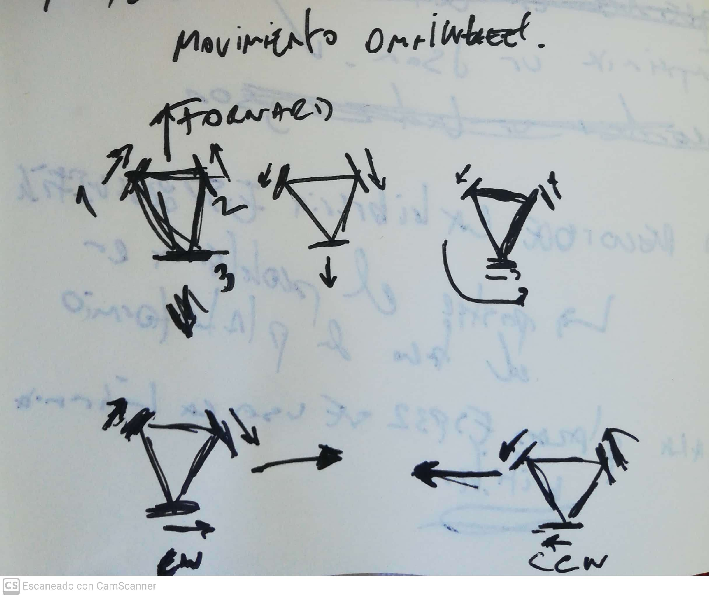
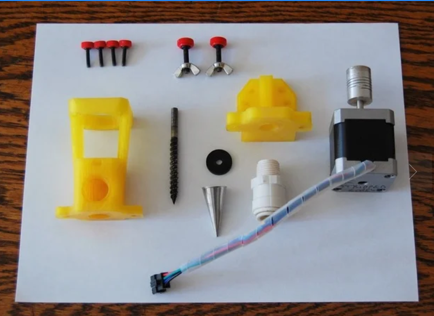
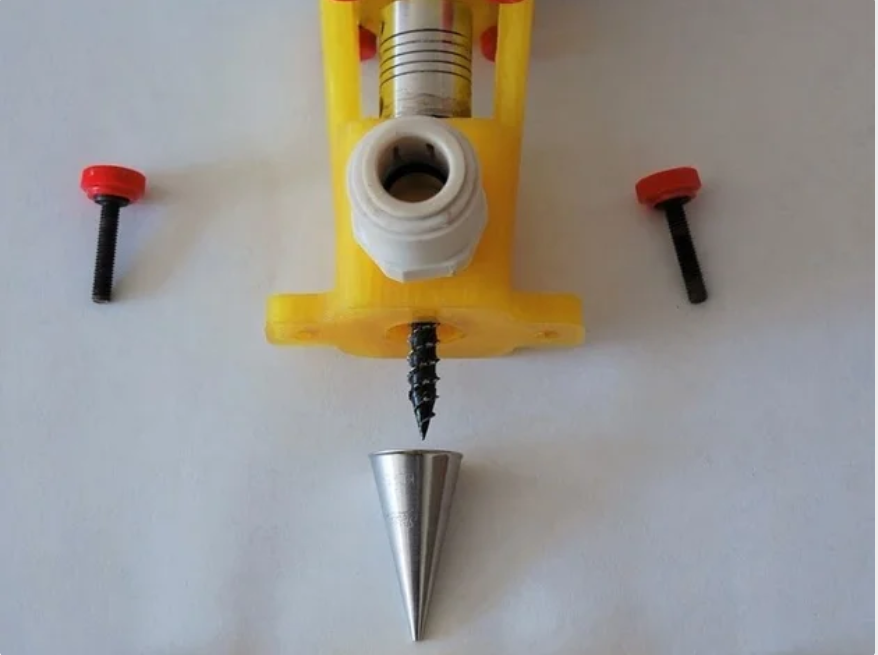
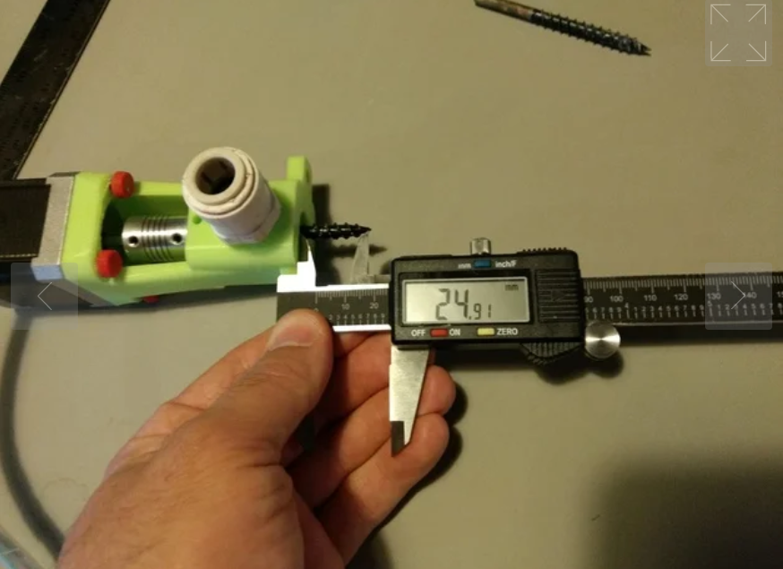
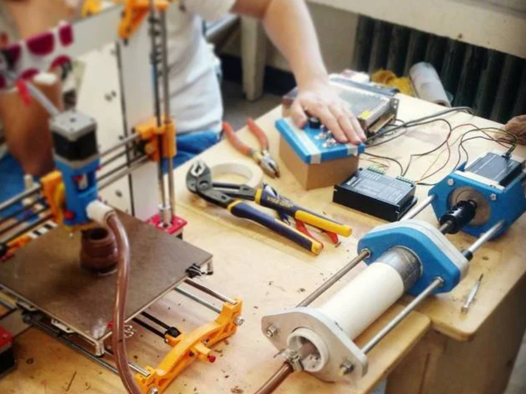

# Importante

Este firmware es temporal, y fue desarrollado para el uso del modulo de Bluetooth clasico de la ESP32, por lo que para utilizarlo deben usar la siguiente [placa](https://afel.cl/producto/placa-desarrollo-doit-wroom-32-bluetooth-wifi/). 

## Sobre el firmware

Este firmware fue hecho en el compilador plataformio, para ser usando en el IDE de Arduino, solo necesitan utilizar el siguiente cogdigo:
- [main](https://github.com/FabLabUTFSM/CareRobots/blob/bluetooth/Firmware/feathe/src/main.cpp) 

Y se necesita descargar la siguiente libreria: 

- [BluetoothSerial](https://github.com/espressif/arduino-esp32/tree/master/libraries/BluetoothSerial)

(Quizas mas, en ese repositorio estan todas las librerias para que el ESP32 funcione en el IDE de Arduino). 

## Modificaciones

Para hacer las pruebas utilize la placa [Adafruit Huzzah Feather ESP32](https://cdn-learn.adafruit.com/assets/assets/000/046/249/original/adafruit_products_Huzzah_ESP8266_Pinout_v1.2-1.png?1504885873), que tengo en mi casa, por lo que en la linea 11: 

- int motor[]= {12,27,33,15,32,14}; deben cambiar por lo pines que estaran usando. 

El arreglo motor esta ordenado de la siguiente manera: motor1 cw, motor1 ccw, motor2 cw, motor2 ccw, motor3 cw, motor3 ccw. 

(cw= clockwise, en el sentido del reloj; ccw= counterclockwise, sentido apuesto al reloj). 

El orden de los motores y de los movimientos se puede ver en el siguiente dibujo.
 

De los movimientos detallados en el dibujo solo estan habilitados el movimiento hacia adelante y atras y giros derecha e izquierda, ya que coinsidere que estos son los 4 esenciales de los 6 posibles. 

## Comunicacion

La comunicacion usuario - robot se establece a traves de bluetooth, para esto podemos utilizar el terminal de serie del IDE de Arduino, o apps de terminal serial para el celular. Para el celular, yo probe [Serial Bluetooth Terminal](https://play.google.com/store/apps/details?id=de.kai_morich.serial_bluetooth_terminal&hl=es_US). 

Para mover el robot, seguir los siguientes comandos: 

- Forward ==> f
- Backward ==> b
- Right ==> r
- Left ==> l

## Sobre el Ensamble

Por favor documenten bien, esto es muy importante si queremos trabajar de forma distribuida, tomen fotos de **TODO!!!!!!**: 

- Fotos de las piezas antes de ensamblar

- Fotos de los sistemas durante el ensamble:

- Fotos de medidas o pasos claves

- Fotos del sistema ensamblado y funcionando: 

Videos de la contruccion de los sistemas tambien son muy utiles!!!

**Esto para todos los sistemas y subsistemas**

Por favor, cada segundo invertido en buena documentacion es un segundo ganado en replicabilidad del proyecto y por ende un segundo ganado en el desarrollo de los robots. 