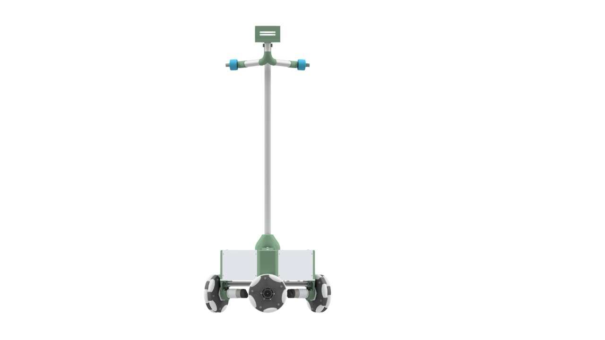
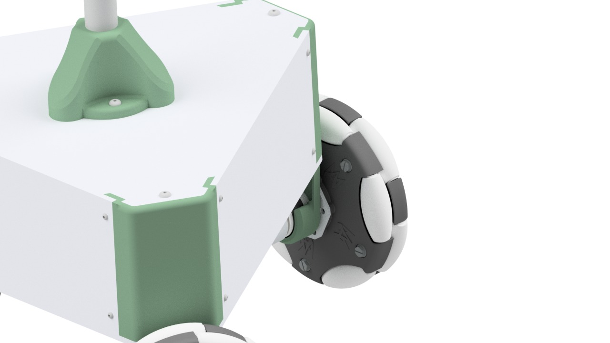
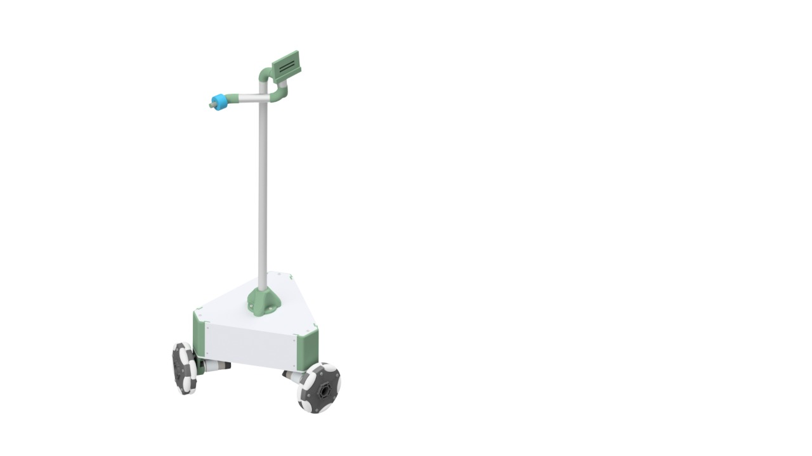
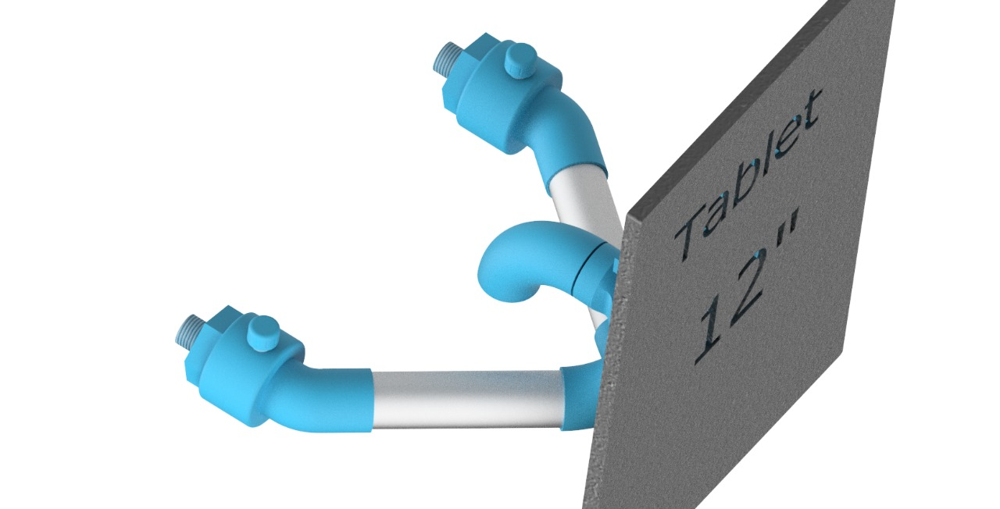
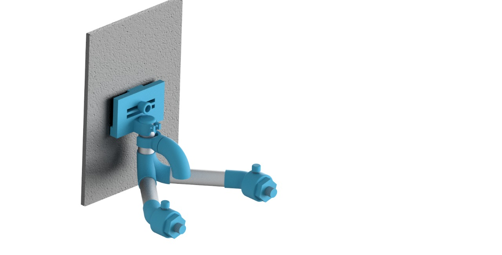

# CareRobots

  

CareRobots is an OpenSoruce project developed by [Fab Lab UTFSM](http://fablab.usm.cl/), [LightHouse-DIG](https://lighthouse-dig.com/), [Center for Engineering Education and Outreach](https://ceeo.tufts.edu/) and [Marionas fab lab]. 

We aim to build low cost telepresence robots, that can be build in any Fab Lab/Makerspace around the world, this robot are intented to protect healthcare service personnel from the COVID-19 spread from infected patients. 

## Structure

   

## Fabrication 

In order to make CareRobots easy to fabricate in any Fab Lab/Makerspace in the world, we only use 3D printers and laser cutters, all parts can be downloaded in the following [link](https://drive.google.com/drive/folders/1tkrLoz_K_6apnlru4AjxvQd69-fxhUXf?usp=sharing).

### 3D Printed - Structure

|Part Name   |Number of parts   |  Download Link |
| :-:   | :-: |  :-: |
|  B1 | 1  |  [link](https://drive.google.com/file/d/1X95zLryoru4crX6b115vtqp_EDh8kSQb/view?usp=sharing)|
|  B2 | 2  |  [link](https://drive.google.com/file/d/1_fum_8d5C-oLnXPcYOniwOqLqxyNqtJm/view?usp=sharing) |  
|  B3 | 1  |  [link](https://drive.google.com/file/d/1nL7G1LNKwou2jkkLmy965ZC8Md9wTHIw/view?usp=sharing) |
|  Bat | 1  |  [link](https://drive.google.com/file/d/17oT4-NMZ_uCZ2WhJEKf6BcBfo7XZ6th5/view?usp=sharing) |
|  L_v2 | 3  |  [link](https://drive.google.com/file/d/1hJeNZyvru78oPO08zw2eOO0yUmgKt_Df/view?usp=sharing) |
|  M | 3  |  [link](https://drive.google.com/file/d/12ri8eZTseVjtSSoXTZQLDR91Xk1uGaeo/view?usp=sharing) |

### Laser Cutted - Structure

|Part Name   |Number of parts   | Format |  Download Link |
| :-:   | :-: |  :-: | :-: |
| A1  |1   | .dxf |  [link](https://drive.google.com/file/d/1qUMhkHjF6LQkufdu41Rsg2A58V7bNPKg/view?usp=sharing) |
| A1  |1   | .pdf |  [link](https://drive.google.com/file/d/10A2T8DMf_OYUFBTCkRg2jiaPDkv-Y5n-/view?usp=sharing) |
| A2  |1   | .dxf |  [link](https://drive.google.com/file/d/1UI6lDsppqcmhL-nH30FwWpygrrH0wOEs/view?usp=sharing) |
| A2  |1   | .pdf |  [link](https://drive.google.com/file/d/1junfC2UCxdz8u_q4p5oR-OMI-dwqzFFS/view?usp=sharing) |
| A3  |3   | .dxf |  [link](https://drive.google.com/file/d/1FhoujUBVxT0hbg1iW205K-4B8KdyHQ2V/view?usp=sharing) |
| A3  |3   | .pdf |  [link](https://drive.google.com/file/d/18cWZgs_5W19GRg0fgFSUVpIVmK2tZZqf/view?usp=sharing) |

### 3D Printed - Gimbal

 

|Part Name   |Number of parts   | Download Link |
| :-:   | :-: |  :-: |
|  100.100.100 Codo Prinicpal | 1  |  [link](https://drive.google.com/file/d/1LrKNzIq5WH4Tc1kQPA7FDwKPdz81MEFJ/view?usp=sharing) |
|  100.100.200 Conector de Pasador | 1  |  [link](https://drive.google.com/file/d/1waasu2H8KbEIScrLwfgzmZHd7Rx-Fj82/view?usp=sharing) |
|  100.200.100 Codo tercero | 1  |  [link](https://drive.google.com/file/d/1nwIYlKD8nJdNT6cQvFXo4gyZvfr2DiPO/view?usp=sharing) |
|  100.200.300 Sujetador | 1  |  [link](https://drive.google.com/file/d/1HpjjEr09sCmCkEBB-0LwTh6nvrJSuSLm/view?usp=sharing) |
|  100.200.400 Codo Secundario  | 1  |  [link](https://drive.google.com/file/d/1zTZWooVP0V9O8LcieDIFtXPp3uPhdiWg/view?usp=sharing) |
|  100.200.500 Peso  | 1  |  [link](https://drive.google.com/file/d/1XWmM778Dlf20GsgeDocvwmgBcEu0HF_q/view?usp=sharing) |
|  100.200.510 Tapa de peso  | 1  |  [link](https://drive.google.com/file/d/1nnNabMoutAxJW8jWdy4tY1yJ_p8wh71P/view?usp=sharing) |
|  100.300.200 Tapa  | 1  |  [link](https://drive.google.com/file/d/1p5FTzZLoxubB07M-G15mzwcnHc5KDI90/view?usp=sharing) |
|  100.400.100 Conector de la tablet  | 1  |  [link](https://drive.google.com/file/d/1OG3XJeAqGO0S7Nu0Kq0IPA0POhfBo3Ik/view?usp=sharing) |
|  100.400.100 Manija | 1  |  [link](https://drive.google.com/file/d/1jl6s8EinCEk0VY1v3JuO_3lAfTZxo3k9/view?usp=sharing) |
|  100.400.400 Soporte Principal | 1  |  [link](https://drive.google.com/file/d/14IcvudmVk-K17IY9RkZWjs_rtM8Tb1c7/view?usp=sharing) |

## Bill of Materials

|Part Name   | Quantity | Unit Price  | Download Link |
| :-:   | :-: |  :-: | :-: |
| OmniWheel   | 3   | $35 |  [link](https://www.andymark.com/products/6-in-duraomni-wheel?sku=am-3154) |
| Motor   | 3   | $33 |  [link](https://www.andymark.com/products/neverest-orbital-3-7-gearmotor?sku=am-3461a) |
| Wheel conversion plate   | 3   | $5.5 |  [link](https://www.andymark.com/products/wheel-conversion-plate?sku=am-2609a) |
| Motor D-Bore Nub  | 3   | $9 |  [link](https://www.andymark.com/products/6-mm-d-bore-xl-double-boss-nub-w-set-screw?sku=am-3441a) |
| Motor Mount Plate  | 6   | $6 |  [link](https://www.andymark.com/products/picobox-leo-mount-plate?sku=am-3474) |
| NodeMcu | 1   | $4.2 |  [link](https://www.amazon.com/NodeMcu-ESP8266-Internet-Development-Micropython/dp/B07PRMJ6QS/ref=sr_1_7_sspa?__mk_es_US=%C3%85M%C3%85%C5%BD%C3%95%C3%91&crid=3P3PAY42WKSSV&dchild=1&keywords=nodemcu+esp8266&qid=1594755022&sprefix=nodemcu%2Caps%2C146&sr=8-7-spons&psc=1&spLa=ZW5jcnlwdGVkUXVhbGlmaWVyPUEzUDRNRDY4NVE0T09aJmVuY3J5cHRlZElkPUEwODA4MzE0QVBUOVhJOFFNSE04JmVuY3J5cHRlZEFkSWQ9QTA5NzM4MzUyWFRVRE5UVFY0UERIJndpZGdldE5hbWU9c3BfbXRmJmFjdGlvbj1jbGlja1JlZGlyZWN0JmRvTm90TG9nQ2xpY2s9dHJ1ZQ==) |
| DC motor driver | 2   | $8.89 |  [link](https://www.amazon.com/-/es/Qunqi-2Packs-Controller-Stepper-Arduino/dp/B01M29YK5U/ref=sr_1_2?__mk_es_US=%C3%85M%C3%85%C5%BD%C3%95%C3%91&dchild=1&keywords=dc+motor+driver+arduino&qid=1594755116&sr=8-2) |
| 12V 7 amp | 1  | $17.89 |  [link](https://www.amazon.com/ExpertPower-EXP1270-Rechargeable-Lead-Battery/dp/B003S1RQ2S/ref=sr_1_1_sspa?__mk_es_US=%C3%85M%C3%85%C5%BD%C3%95%C3%91&crid=3SHR0DPZA47Z2&dchild=1&keywords=12v+battery&qid=1594755183&sprefix=12v+bate%2Caps%2C138&sr=8-1-spons&psc=1&spLa=ZW5jcnlwdGVkUXVhbGlmaWVyPUEyQ0FLVlk1NEdVOVdXJmVuY3J5cHRlZElkPUEwOTg0NjU0M1I1NVhMREdLVFBaVyZlbmNyeXB0ZWRBZElkPUEwMzY0NTEyQUI2UjZENVEyVzBHJndpZGdldE5hbWU9c3BfYXRmJmFjdGlvbj1jbGlja1JlZGlyZWN0JmRvTm90TG9nQ2xpY2s9dHJ1ZQ==2) |
| DC - DC 5Amp Buck converter | 1  | $6.69 |  [link](https://www.amazon.com/-/es/DZS-Elec-Step-down-Regulator-Converter/dp/B07BDDMGLG/ref=sr_1_42?__mk_es_US=%C3%85M%C3%85%C5%BD%C3%95%C3%91&dchild=1&keywords=stepdown+arduino&qid=1594755241&sr=8-42) |
| 12V Battery conector | 1  | $7.99 |  [link](https://www.amazon.com/-/es/KASSupply-Connector-Disconnect-Terminals-Connection/dp/B07M5M8ZCG/ref=bmx_10?_encoding=UTF8&pd_rd_i=B07M5M8ZCG&pd_rd_r=6c7c81cb-37f0-4353-9c8a-7bd4b10f2eeb&pd_rd_w=SVysQ&pd_rd_wg=QSzcm&pf_rd_p=72f29bc1-c160-4012-b633-f54cb49b9557&pf_rd_r=2E8Y03Z7MB76D1S6Q47N&psc=1&refRID=2E8Y03Z7MB76D1S6Q47N) |
| Battery charger | 1  | $10.66 |  [link]( https://www.amazon.com/-/es/Sealed-Lead-Battery-Charger-D1724/dp/B001G8AIMU/ref=bmx_1/147-5340813-4688129?_encoding=UTF8&pd_rd_i=B001G8AIMU&pd_rd_r=6c7c81cb-37f0-4353-9c8a-7bd4b10f2eeb&pd_rd_w=SVysQ&pd_rd_wg=QSzcm&pf_rd_p=72f29bc1-c160-4012-b633-f54cb49b9557&pf_rd_r=2E8Y03Z7MB76D1S6Q47N&psc=1&refRID=2E8Y03Z7MB76D1S6Q47N ) |
| Thread M5x250  | 3  | $0.7***|  [link]( https://www.amazon.com/-/es/uxcell-150mm-Stainless-Threaded-Hardware/dp/B01M5DGV0P/ref=sr_1_2?__mk_es_US=%C3%85M%C3%85%C5%BD%C3%95%C3%91&dchild=1&keywords=varilla+roscada+m5&qid=1595109863&sr=8-2) |
| Screw M5x25 | 6  | $0.19* |  [link]( https://www.mcmaster.com/screws/rounded-head-screws/hex-drive-rounded-head-screws/metric-316-stainless-steel-button-head-hex-drive-screws/) |
| Screw M5x16 | 6  | $0.17* |  [link](https://www.mcmaster.com/screws/rounded-head-screws/hex-drive-rounded-head-screws/metric-316-stainless-steel-button-head-hex-drive-screws/ ) |
| Screw M4x16 | 6  | $0.08** |  [link](https://www.mcmaster.com/screws/rounded-head-screws/hex-drive-rounded-head-screws/metric-316-stainless-steel-button-head-hex-drive-screws/ ) |
| Screw M3x16 | 38  | $0.05** |  [link](https://www.mcmaster.com/screws/rounded-head-screws/hex-drive-rounded-head-screws/metric-316-stainless-steel-button-head-hex-drive-screws/ ) |
| M5 nut | 24  | $0.06** |  [link](https://www.mcmaster.com/nuts/hex-nuts/metric-18-8-stainless-steel-hex-nuts/ ) |
| M4 nut | 3  | $0.06** |  [link](https://www.mcmaster.com/nuts/hex-nuts/metric-18-8-stainless-steel-hex-nuts/ ) |
| M3 nut | -  | $0.06** |  [link](https://www.mcmaster.com/nuts/hex-nuts/metric-18-8-stainless-steel-hex-nuts/ ) |
| M3 Set Screw | 6  | $0.1* |  [link](https://www.mcmaster.com/nuts/hex-nuts/metric-18-8-stainless-steel-hex-nuts/ ) |
* 50 unit package
** 100 unit package
*** 10 unit package

## Assembly

Pictures of the assembly process. 
